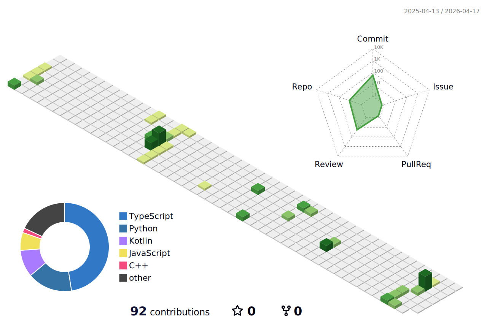

<h1 align="center">Hi 👋, I'm Muhammad Abdullah Shahid</h1>
<h3 align="center">Backend & AI Engineer | Real-Time Systems | LangChain | Automation | MLOps</h3>

  

  
  
  

---

## 🚀 About Me

- 🎓 Computer Science student at **FAST-NUCES, Lahore**
- ⚙️ Interested in **Backend Engineering, AI Systems, Real-Time Systems, Automation, and MLOps**
- 🧠 Exploring **LangChain-based workflows, AI agents, inference pipelines, and production AI systems**
- 🛠️ Building with **APIs, databases, WebSockets, infrastructure, and deployment-focused architectures**
- 🌍 Open to **remote internships** and **software engineering opportunities**

---

## 🛠️ Tech Stack

  

### Backend & Systems
- REST APIs
- WebSockets
- Ktor
- PostgreSQL
- Supabase
- Scalable backend design

### AI / ML / MLOps
- NLP
- Computer Vision
- Speech-to-Text
- LangChain
- Automation workflows
- Inference pipelines
- MLOps fundamentals

### Frontend
- React
- React Native
- Android-oriented development

### DevOps & Infra
- Docker
- Jenkins
- GitHub Actions
- Linux

---

## 📌 Featured Projects

### 🔹 CrisisConnect — Real-Time Disaster Alert System
- Built a real-time disaster alert platform with Android client and backend services
- Developed backend APIs using **Kotlin (Ktor)** with **PostgreSQL hosted on Supabase**
- Implemented continuous data ingestion and **WebSocket-based real-time alerts**

### 🔹 Real-Time Sign Language Translator
- Designed and implemented a low-latency system for **Audio ↔ ASL** translation
- Integrated **RT-DETR** with speech recognition into a unified inference pipeline
- Collected and labeled custom ASL datasets using **Label Studio**

### 🔹 Crisis Intelligence NLP Pipeline
- Built a pipeline to ingest live crisis news, generate summaries, and extract structured signals
- Designed for downstream alerting, analysis, and decision-support integration

### 🔹 Skill Swap Platform
- Developed web and mobile applications using **React** and **React Native**
- Implemented real-time messaging using **WebSockets**
- Designed relational database schemas for matching and state consistency

---

## 📊 GitHub Stats

  
  

---

## 🐍 Contribution Snake

  

---

## 📈 3D Contribution Graph

  

---

## 🌐 Connect With Me

  
  

